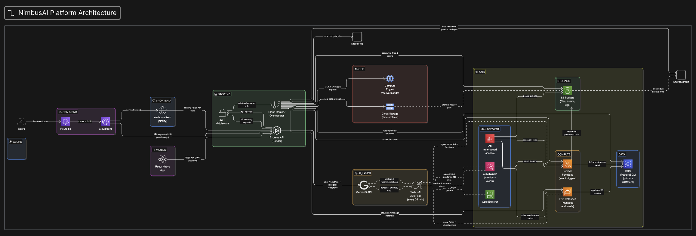

# NimbusAI — Enterprise Multi-Cloud Automation Platform

🌐 **Live Demo:** [nimbus-ai.tech](https://nimbus-ai.tech/login.html)  
📱 **Mobile App:** [GitHub](https://github.com/shlok2018/nimbus-ai-mobile)  
⚙️ **Backend API:** [nimbus-backend-qryv.onrender.com](https://nimbus-backend-qryv.onrender.com)

> **Demo Login:** admin / admin123

---

## Architecture



---

## What is NimbusAI?

An AI-powered enterprise platform that connects AWS, Azure, and GCP simultaneously — with real-time data pipelines, autonomous monitoring, and Gemini 3 AI for intelligent infrastructure management. Built to solve the real problem of managing multi-cloud infrastructure from a single unified dashboard.

---

## Features

| Feature | Description |
|---------|-------------|
| 🤖 AI Command Center | Gemini 3 with real AWS context injection — account-specific advice |
| ☁️ Multi-Cloud Dashboard | AWS + Azure + GCP unified real-time view |
| 🔐 JWT Authentication | bcrypt password hashing, role-based access, 8h sessions |
| 🤖 AutoPilot Agent | Autonomous monitoring every 30 min — auto-fixes security issues |
| 🏗 Architecture Diagram | Live infrastructure map of your real AWS account |
| ⚡ One-Click Actions | Create S3, start/stop EC2, RDS snapshots, scale ECS, invoke Lambda |
| 💰 FinOps Dashboard | Real-time cost analytics by service |
| 🛡 Security Hub | Detects and auto-remediates security misconfigurations |
| 📱 Mobile App | React Native iOS/Android with 5 screens |
| 🔄 CI/CD Builder | Pipeline automation workflows |

---

## Tech Stack

### Frontend


### Backend


### Cloud


### AI


### Auth


### Deployment


### Mobile


---

## AWS Services Integrated

| Service | Usage |
|---------|-------|
| EC2 | List, start, stop, reboot instances |
| S3 | List, create, delete buckets with encryption |
| Lambda | List and invoke functions |
| RDS | List instances, create snapshots |
| CloudWatch | Alarms and metrics monitoring |
| IAM | Users and access key management |
| Cost Explorer | Monthly billing analytics |
| ECS/Fargate | Cluster and service scaling |

---

## AutoPilot Agent

NimbusAI includes an autonomous AI agent that runs every 30 minutes and:

- 🔍 Scans for public S3 buckets → auto-blocks public access
- 🔔 Monitors active CloudWatch alarms
- 💰 Detects stopped EC2 instances wasting money
- 🔒 Checks RDS encryption compliance
- 📝 Logs all findings and auto-remediation actions

---

## Setup Instructions

### Prerequisites
- Node.js v18+
- AWS Account with IAM credentials
- Google Gemini API key (free at aistudio.google.com)
- Azure subscription (optional)
- GCP project (optional)

### Backend Setup

```bash
cd nimbus-backend
npm install
cp .env.example .env
# Add your keys to .env
node server.js
```

### Frontend Setup

```bash
cd public
npx serve .
# Open http://localhost:3000/login.html
```

### Environment Variables

```
AWS_ACCESS_KEY_ID=your_key
AWS_SECRET_ACCESS_KEY=your_secret
AWS_REGION=us-east-1
GEMINI_API_KEY=your_gemini_key
JWT_SECRET=your_jwt_secret
AZURE_TENANT_ID=your_tenant_id
AZURE_CLIENT_ID=your_client_id
AZURE_CLIENT_SECRET=your_secret
AZURE_SUBSCRIPTION_ID=your_subscription_id
GCP_PROJECT_ID=your_project_id
PORT=3001
```

---

## Demo Credentials

| Username | Password | Role |
|----------|----------|------|
| admin | admin123 | Full admin access |
| demo | demo123 | Read only viewer |

---

## API Endpoints

| Method | Endpoint | Description |
|--------|----------|-------------|
| POST | /api/auth/login | JWT authentication |
| GET | /api/dashboard | Unified AWS summary |
| GET | /api/ec2/instances | List EC2 instances |
| GET | /api/s3/buckets | List S3 buckets |
| GET | /api/lambda/functions | List Lambda functions |
| GET | /api/rds/instances | List RDS databases |
| GET | /api/cloudwatch/alarms | Get CloudWatch alarms |
| GET | /api/cost/monthly | Monthly cost by service |
| POST | /api/ai/chat | Gemini AI with AWS context |
| GET | /api/multicloud | All 3 clouds summary |
| GET | /api/azure/vms | Azure virtual machines |
| GET | /api/gcp/instances | GCP compute instances |
| POST | /api/autopilot/run | Run AutoPilot scan |
| GET | /api/autopilot/status | AutoPilot status |
| POST | /api/actions/s3/create | Create S3 bucket |
| POST | /api/actions/ec2/start/:id | Start EC2 instance |
| POST | /api/actions/ec2/stop/:id | Stop EC2 instance |

---

## Author

**Shlok Sharma**  
Northeastern University  
[LinkedIn](https://linkedin.com/in/your-profile) | [GitHub](https://github.com/shlok2018)

---

## License

MIT License — feel free to use this project for learning and inspiration.
